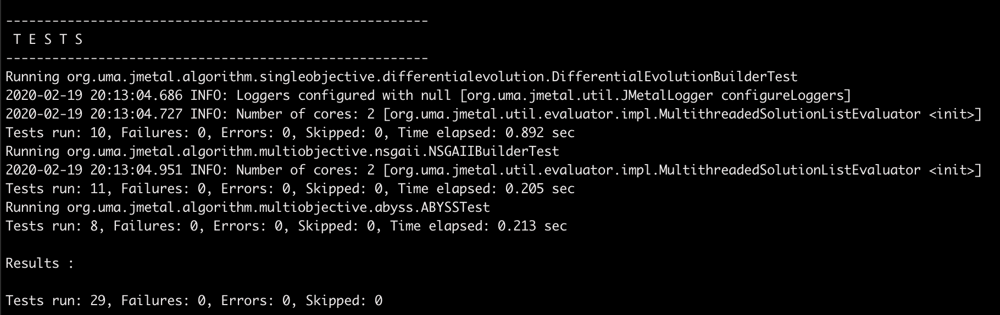
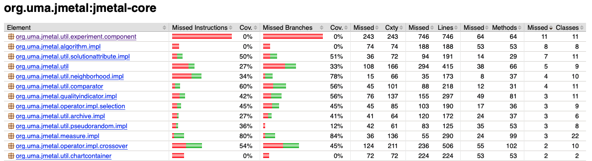
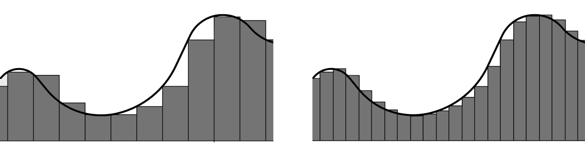
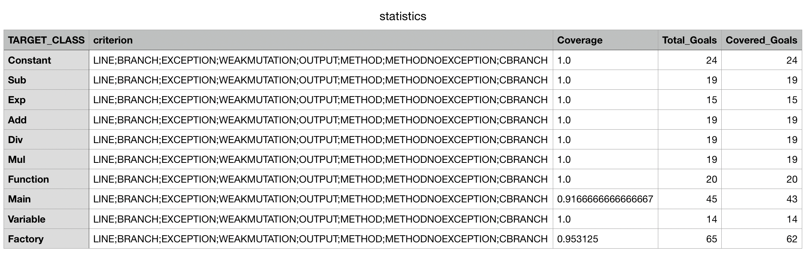

\newpage

## PARTE 1

Hemos descargado el proyecto jMetal desde github.
Había varias opciones para hacerlos pues en github mantienen versiones anteriores de la aplicación, versiones que actualmente están en desarrollo y la última release.
Hemos realizado los test sobre las siguientes versiones:

* jMetal 6.0 disponible en: https://github.com/jMetal/jMetal
* jMetal 5.7 disponible en: https://github.com/jMetal/jMetal/blob/gh-pages/jMetal-jmetal-5.6.zip (En la url pone 5.6 pero realmente se descarga la versión 5.7)
* jMetal 5.0 disponible en: https://github.com/jMetal/jMetal/blob/gh-pages/jMetal-jmetal-5.0.zip

Para descargar las versiones tan solo es necesario clonar el repositorio jMetal.
Esto nos dará acceso a la versión actual y a la última release.

En otro repositorio podremos encontrar las versiones anteriores del programa en formato .zip

Para descargar cada versión se utiliza el comando git clone sobre el repositorio adecuado.

```bash
git clone https://github.com/jMetal/jMetal.git
```

### Explicaciones necesarias

El código de jMetal se encuentra repartido en cuatro carpetas distintas.
Existe un archivo pom.xml que mediante la herramienta maven nos permite compilar y probar todas las carpetas a la vez.
No obstante dentro de cada carpeta existirá otro archivo pom.xml que rige como realizar la compilación y los tests del código contenido en la carpeta concreta.
Adicionalmente los archivos pom.xml declaran las dependencias del proyecto.

Para la versión de jMetal que utilizaremos como ejemplo para hacer esta memoria existen las siguientes carpetas:

```bash
ls jMetal-master5.7 | grep jmetal

  jmetal-algorithm
  jmetal-core
  jmetal-exec
  jmetal-problem
```

Las consecuencias de esta estructura son que cuando compilemos obtendremos una carpeta con el resultado de la compilación para cada uno de los proyectos.
También ocurrirá lo mismo con los informes producidos tras la ejecución de los tests.

### Ejecución de los tests

El primer paso ha sido descargar de github el código junto con los tests.
Posteriormente hemos ejecutado las siguientes instrucciones sobre cada uno de las versiones descargadas.

```bash
mvn compile
mvn test
```

El resultado de la primera instrucción es obtener el código compilado en formato .jar el cual será ubicado en la carpeta target de cada proyecto por las razones explicadas en el apartado anterior.

Cuando ejecutemos la segunda instrucción los casos de prueba se ejecutarán sobre cada uno de los proyectos.
Los test de cada proyecto están almacenados dentro de él en la carpeta jMetal-master5.7/jmetal-*/src/test.
El resultado de la ejecución de los test, es decir, los informes sobre si se han producido errores en la ejecución de estos se almacenarán en jMetal-master5.7/jmetal-*/target/surefire-reports/

Del nombre de la carpeta en la que se almacenan los tests deducimos que la herramienta utilizada para ejecutarlos es maven **Surefire**.

#### Resultado de los tests

Como hemos indicado todos los resultado se encuentran en las carpetas mencionadas anteriormente.
Adicionalmente sobre cada proyecto sobre el que se ejecutan los tests obtendremos estos resultados por pantalla de los que añadimos una captura.


La imagen muestra el resultado de la ejecución de los tests para el proyecto jmetal-algorithm.

### Cálculo de la cobertura

Aprovecharemos que jMetal ya incorpora una herramienta para realizar el cálculo de la cobertura para ver la calidad de los tests.

Dicha herramienta es **jacoco** y sus resultados podremos verlos en formato de página web accesible desde jMetal-master5.7/jmetal-*/target/site/jacoco/index.html
Las métricas que nos produce son:

* **Branches**: Ramas de ejecución (su número está relacionado con el de instrucciones de control) por las que la ejecución de los test ha pasado.
* **Cxty**: Complejidad ciclomática del código
* **Lines**: cantidad de código ejecutado por los tests medido en líneas.
* **Methods**: cantidad de métodos que han sido ejecutados en los tests.
* **Classes**: la cantidad de clases de la que se ha ejecutado código.

#### Resultado de la cobertura

Insertamos una captura de la página web creada por jacoco.


Aunque la ejecución de los test ha dado muy buenos resultados ya que no se ha producido ningún error en ellos el análisis de la cobertura nos indica que estos buenos resultados no tienen gran relevancia.
A lo largo de todo el proyecto podemos ver que la cobertura es mínima.

### Ejecución de un ejemplo

Adicionalmente hemos probado algunos de los ejemplos incluidos con la aplicación para comprobar que se ejecutaban adecuadamente.
Incluimos los comandos ejecutados para probar el algoritmo de optimización multi objetivo NSGAII.

```bash
mvn package
export CLASSPATH=jmetal-core/target/jmetal-exec-5.7-SNAPSHOT-jar-with-dependencies.jar:\
  jmetal-problem/target/jmetal-exec-5.7-SNAPSHOT-jar-with-dependencies.jar:\
  jmetal-exec/target/jmetal-exec-5.7-SNAPSHOT-jar-with-dependencies.jar:\
  jmetal-problem/target/jmetal-exec-5.7-SNAPSHOT-jar-with-dependencies.jar
java org.uma.jmetal.runner.multiobjective.NSGAIIRunner
```

## PARTE 2

Crearemos un código de ejemplo en Java que consistirá en un método aproximado de calcular integrales.
Dicho código se compone de dos partes, una encargada del cálculo de la integral y otra encargada de construir la función sobre la que la integral se va a calcular.

Para construir la función tendremos múltiples, clases que forman un árbol de ejecución, que al evaluarse proporciona el valor de la función para el punto concreto que se esté evaluando.
El método aproximado utilizado calcula iterativamente pequeños trozos del área bajo la función en varios puntos de esta y los acumula.
Podremos de este modo calcular integrales finitas acotadas entre dos valores reales, con una precisión proporcional a la cantidad de áreas que calculemos.
Para poder calcular más cantidad de áreas estas deberán de tener una anchura menor.
Para una mejor explicación de esto ver la figura.



### Evosuite

Para realizar las pruebas sobre el código hemos utilizado la herramienta de [Evosuite](http://www.evosuite.org).
Esta herramienta crea casos de prueba unitarios de forma automática a partir del código precompilado.

Para poderla utilizar primero deberemos compilar nuestro código utilizando los comandos.
El primero creará los archivos .class que contienen el bytecode de la precompilación y el segundo los ejecutará.

```bash
javac Main.java
java Main
```

Ahora podremos utilizar estos archivos .class para crear las pruebas unitarias a partir de ellos mediante Evosuite.
Esto lo hacemos mediante:

```bash
java -jar evosuite-1.0.6.jar -target ./integrals-java
```

Tras ejecutar el comando obtendremos dos carpetas, una en las que se crea un archivo .csv en el que podremos encontrar el informe sobre las coberturas de cada clase probada.
En nuestro caso debido a la simplicidad del código la cobertura obtenida será del 100% para casi todas las clases.
Las excepciones se producen en la clase main y en la factoría utilizada para crear las funciones.


En la otra carpeta se generarán las pruebas unitarias.
Por cada clase Evosuite construye dos archivos, uno denominado Scarforlding que sirve se ayuda para ejecutar el otro que son las pruebas unitarias en sí.

Exploraremos a continuación los casos de prueba creados para la clase Sub.
Esta clase se encarga de representar una función de resta.
Lo que realiza la clase es por tanto restar los dos calores pasado a su función de evaluar.

### Clase original (Sub)

```java
public class Sub implements Operation {
  public double evaluate (double value1, double value2){
    return value1-value2;
  }
}
```

### Pruebas unitarias generadas por Evosuite (Sub)

```java
/*
 * This file was automatically generated by EvoSuite
 * Wed Feb 19 18:15:21 GMT 2020
 */


import org.junit.Test;
import static org.junit.Assert.*;
import org.evosuite.runtime.EvoRunner;
import org.evosuite.runtime.EvoRunnerParameters;
import org.junit.runner.RunWith;

@RunWith(EvoRunner.class) @EvoRunnerParameters(
  mockJVMNonDeterminism = true, useVFS = true,
  useVNET = true, resetStaticState = true,
  separateClassLoader = true, useJEE = true)
public class Sub_ESTest extends Sub_ESTest_scaffolding {

  @Test(timeout = 4000)
  public void test0()  throws Throwable  {
      Sub sub0 = new Sub();
      double double0 = sub0.evaluate(1.0, 0.0);
      assertEquals(1.0, double0, 0.01);
  }

  @Test(timeout = 4000)
  public void test1()  throws Throwable  {
      Sub sub0 = new Sub();
      double double0 = sub0.evaluate(0.0, 328.4513056382236);
      assertEquals((-328.4513056382236), double0, 0.01);
  }

  @Test(timeout = 4000)
  public void test2()  throws Throwable  {
      Sub sub0 = new Sub();
      double double0 = sub0.evaluate((-1392.599), (-1392.599));
      assertEquals(0.0, double0, 0.01);
  }
}
```

Como podemos ver Evosuite es capaz de realizar pruebas válidas sobre la clase proporcionada.

En el siguiente caso podremos ver como Evosuite busca maximizar la cobertura de la clase proporcionada.

### Clase original (Factory)

```java
class Factory {
  public Expresion c(double value){
    return new Constant(value);
  }
  public Expresion x(){
    return new Variable();
  }
  public Expresion f(Operation operation, Expresion e1, Expresion e2){
    return new Function(operation, e1, e2);
  }
  public Operation o(char operation){
    switch(operation){
      case '+': return new Add();
      case '-': return new Sub();
      case '*': return new Mul();
      case '/': return new Div();
      case '^': return new Exp();
    }
    return null;
  }
}
```

### Pruebas unitarias generadas por Evosuite (Factory)

```java
/*
 * This file was automatically generated by EvoSuite
 * Wed Feb 19 18:19:08 GMT 2020
 */


import org.junit.Test;
import static org.junit.Assert.*;
import org.evosuite.runtime.EvoRunner;
import org.evosuite.runtime.EvoRunnerParameters;
import org.junit.runner.RunWith;

@RunWith(EvoRunner.class) @EvoRunnerParameters(
  mockJVMNonDeterminism = true, useVFS = true,
  useVNET = true, resetStaticState = true,
  separateClassLoader = true, useJEE = true)
public class Factory_ESTest extends Factory_ESTest_scaffolding {

  @Test(timeout = 4000)
  public void test0()  throws Throwable  {
      Factory factory0 = new Factory();
      Operation operation0 = factory0.o('`');
      assertNull(operation0);
  }

  @Test(timeout = 4000)
  public void test1()  throws Throwable  {
      Factory factory0 = new Factory();
      Operation operation0 = factory0.o('/');
      assertNotNull(operation0);
  }

  @Test(timeout = 4000)
  public void test2()  throws Throwable  {
      Factory factory0 = new Factory();
      Operation operation0 = factory0.o('-');
      assertNotNull(operation0);
  }

  @Test(timeout = 4000)
  public void test3()  throws Throwable  {
      Factory factory0 = new Factory();
      Operation operation0 = factory0.o('+');
      assertNotNull(operation0);
  }

  @Test(timeout = 4000)
  public void test4()  throws Throwable  {
      Factory factory0 = new Factory();
      Operation operation0 = factory0.o('^');
      assertNotNull(operation0);
  }

  @Test(timeout = 4000)
  public void test5()  throws Throwable  {
      Factory factory0 = new Factory();
      Operation operation0 = factory0.o('*');
      assertNotNull(operation0);
  }

  @Test(timeout = 4000)
  public void test6()  throws Throwable  {
      Factory factory0 = new Factory();
      Expresion expresion0 = factory0.x();
      assertNotNull(expresion0);
  }

  @Test(timeout = 4000)
  public void test7()  throws Throwable  {
      Factory factory0 = new Factory();
      Constant constant0 = (Constant)factory0.c((-1563.7537723204189));
      assertEquals((-1563.7537723204189), constant0.evaluate(), 0.01);
  }

  @Test(timeout = 4000)
  public void test8()  throws Throwable  {
      Factory factory0 = new Factory();
      Variable variable0 = new Variable();
      Expresion expresion0 = factory0.f((Operation) null, variable0, variable0);
      assertNotNull(expresion0);
  }
}
```

### Ejecución de las pruebas generadas

Para ejecutar las pruebas primero deberemos descargar las depèndencias adecuadas.

```bash
# JUNIT
mvn dependency:get -DremoteRepositories=http://repo1.maven.org/maven2/ \
                   -DgroupId=junit -DartifactId=junit -Dversion=4.12 \
                   -Dtransitive=false
# Hamcrest
mvn dependency:get -DremoteRepositories=http://repo1.maven.org/maven2/ \
                   -DgroupId=org.hamcrest -DartifactId=hamcrest-core -Dversion=1.3 \
                   -Dtransitive=false
```

Posteriormente deberemos añadir tanto esas dependencias como las de evosuite, evosuite runtime y las de nuestro código (con los .class es suficiente, no hace falta crear un .jar) al $CLASSPATH.
Ahora deberemos indicar a JUnit que ejecute todas las clases que contienen los Tests. Es decir, aquellas clases que no son de Scarfolfing.

```bash
test=$(find . ! -name "*_scaffolding*" -type f |\
       grep .class | cut -d"." -f2 | cut -d"/" -f2)
java org.junit.runner.JUnitCore $test
```

Podremos ahora ver que los test se ejecutan y que todos finalizan satisfactoriamente.

```bash
JUnit version 4.12
...
Time: 1.905

OK (41 tests)
```

### Calculo de la cobertura

También podemos calcular la cobertura a partir de los casos de prueba creados.
Para ello deberemos proporcionar el caso de prueba que ejecutar y la clase sobre la que calcular la cobertura.
Los resultados obtenidos coincidirán con los que ya se obtuvieron al crear los casos de prueba.

```bash
coverage () {
  TARGETCLASS=$1
  TARGETTEST=$1_ESTest

  java -jar evosuite-1.0.6.jar -measureCoverage \
    -class $TARGETCLASS -Djunit=$TARGETTEST \
    -criterion branch -projectCP ../integrals-java:./evosuite-tests
}

classes=$(java -jar evosuite-1.0.6.jar -listClasses -target ../integrals-java)
for class in ${classes[@]};
do
  echo "-----------COVERAGE-----------"
  echo $class
  echo "------------------------------"
  coverage $class
done
```
